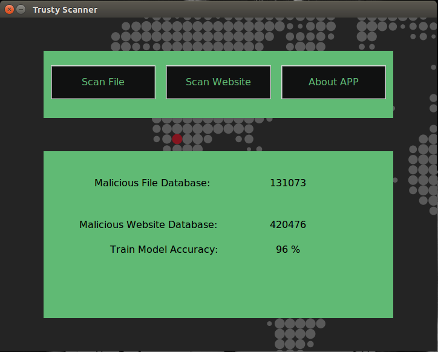
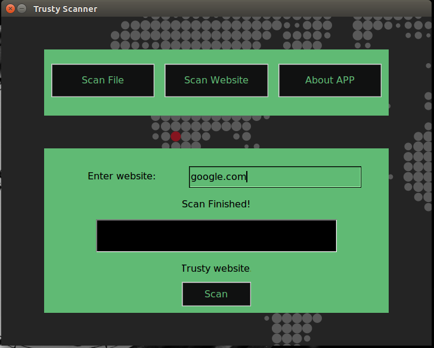
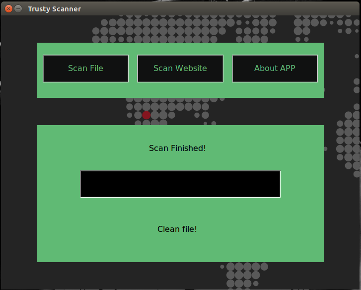

# Trusty-Scanner
College Project - Simple Malware Scanner

1. Scan File - This option is searching in a known malware database

2. Scan Website - Trained model to detect some kind of phishing technique
      (This is informative because creating a domain name is so vast
      and is hard to detect all phishing sites through their names and extensions)


- To install dependencies: ``` pip3 install -r requirements.txt ```

- To run application: ``` python3 gui.py ```
      
            
College: Transilvania University of Brasov, Romania

Course:  Programming techniques

Coord:   Danciu Gabriel

## Notes

- About Page

File database is made from https://virusshare.com/.

Website database is made from random sites, it's not very precise.



- Website Option



- File Option

